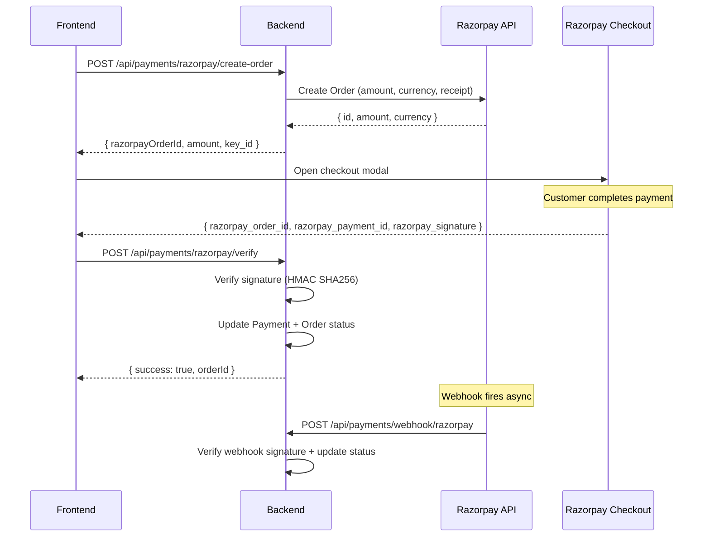
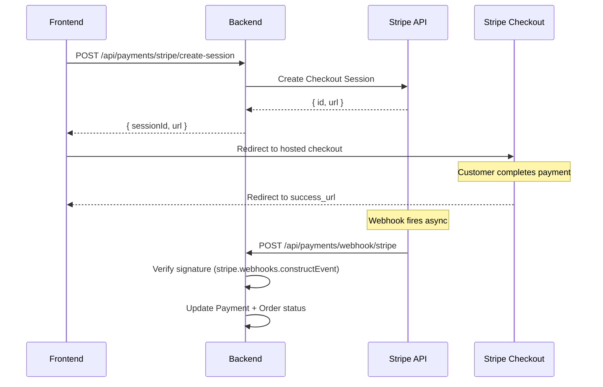

# Payment Gateway Debug — TFI Club

## Architecture Overview

TFI Club uses a **dual payment gateway** architecture:
- **Razorpay** — For Indian customers (INR)
- **Stripe** — For international customers (multi-currency)
- **COD** — Cash on Delivery (no gateway)

### Backend Files
| File | Purpose |
|------|---------|
| `payments.controller.ts` | Unified endpoints for all payment operations |
| `payments.service.ts` | Payment orchestration, status management, webhook routing |
| `razorpay.service.ts` | Razorpay-specific: order creation, verification, refunds |
| `stripe.service.ts` | Stripe-specific: session creation, webhook handling |
| `dto/` | Request validation DTOs |
| `interfaces/` | TypeScript interfaces for payment types |

### Database Models
```
Payment ──→ 1:N Transaction  (charge/refund/settlement records)
        ──→ 1:N Refund        (refund requests)

Order ──→ 1:N Payment         (one order can have multiple payment attempts)

WebhookLog                     (all webhook events for debugging)
```

---

## Razorpay Integration

### Payment Flow



### Razorpay Order Creation
```typescript
// In razorpay.service.ts
const order = await this.razorpay.orders.create({
  amount: amountInPaise,  // Razorpay expects amount in PAISE (1 INR = 100 paise)
  currency: 'INR',
  receipt: `order_${orderId}`,
  notes: { orderId, userId },
});
```

> **CRITICAL:** Razorpay amounts are in **paise** (smallest currency unit). ₹999 = 99900 paise.

### Razorpay Signature Verification
```typescript
import crypto from 'crypto';

const expectedSignature = crypto
  .createHmac('sha256', RAZORPAY_KEY_SECRET)
  .update(`${razorpay_order_id}|${razorpay_payment_id}`)
  .digest('hex');

const isValid = expectedSignature === razorpay_signature;
```

### Common Razorpay Errors

| Error | Cause | Fix |
|-------|-------|-----|
| `BAD_REQUEST_ERROR: The amount must be an integer` | Passing float amount | Convert to integer paise: `Math.round(amount * 100)` |
| `Signature mismatch` | Wrong key secret or malformed body | Check `RAZORPAY_KEY_SECRET`, verify `order_id|payment_id` format |
| `Order already paid` | Duplicate verification call | Check idempotency — use `idempotencyKey` in Payment model |
| `Payment failed` | Card declined, insufficient funds | Show customer-friendly error from `error.description` |
| `Webhook signature invalid` | Wrong webhook secret | Verify `RAZORPAY_WEBHOOK_SECRET` matches dashboard config |

### Razorpay Webhook Events
```typescript
// Key events to handle:
switch (body.event) {
  case 'payment.captured':    // Payment successful
  case 'payment.failed':      // Payment failed
  case 'refund.created':      // Refund initiated
  case 'refund.processed':    // Refund completed
  case 'order.paid':          // Order fully paid
}
```

### Razorpay Webhook Signature Verification
```typescript
const expectedSignature = crypto
  .createHmac('sha256', RAZORPAY_WEBHOOK_SECRET)
  .update(rawBody)  // Must use rawBody, not parsed JSON
  .digest('hex');

const isValid = expectedSignature === req.headers['x-razorpay-signature'];
```

> **CRITICAL:** Use `req.rawBody` (Buffer), NOT `JSON.stringify(body)`. The raw body preserves exact formatting that the signature was computed over. `rawBody: true` is enabled in `main.ts`.

---

## Stripe Integration

### Payment Flow



### Stripe Session Creation
```typescript
const session = await this.stripe.checkout.sessions.create({
  payment_method_types: ['card'],
  mode: 'payment',
  line_items: items.map((item) => ({
    price_data: {
      currency: 'usd',
      product_data: {
        name: item.name,
        images: [item.image],
      },
      unit_amount: Math.round(item.price * 100), // Stripe uses cents
    },
    quantity: item.quantity,
  })),
  success_url: `${FRONTEND_URL}/order-success?session_id={CHECKOUT_SESSION_ID}`,
  cancel_url: `${FRONTEND_URL}/checkout?cancelled=true`,
  metadata: { orderId, userId },
});
```

> **CRITICAL:** Stripe amounts are in **cents** (smallest currency unit). $9.99 = 999 cents.

### Stripe Webhook Verification
```typescript
const event = stripe.webhooks.constructEvent(
  rawBody,                    // Must be raw body buffer
  req.headers['stripe-signature'],
  STRIPE_WEBHOOK_SECRET,
);
```

### Key Stripe Webhook Events
```typescript
switch (event.type) {
  case 'checkout.session.completed':   // Payment successful
  case 'payment_intent.succeeded':     // Payment confirmed
  case 'payment_intent.payment_failed': // Payment failed
  case 'charge.refunded':              // Refund processed
}
```

### Common Stripe Errors

| Error | Cause | Fix |
|-------|-------|-----|
| `No signatures found matching the expected signature` | Wrong webhook secret | Verify `STRIPE_WEBHOOK_SECRET` from Stripe dashboard → Webhooks |
| `Invalid value for stripe.checkout.sessions.create` | Bad line_items format | Check `unit_amount` is integer, `currency` is lowercase |
| `Webhook endpoint must be HTTPS` | Local development | Use Stripe CLI: `stripe listen --forward-to localhost:3001/api/payments/webhook/stripe` |
| `Resource already exists` | Duplicate session creation | Use idempotency key: `{ idempotencyKey: orderId }` |

---

## Debugging Checklist

### Payment Not Processing
1. **Check WebhookLog table** — Was the webhook received?
   ```sql
   SELECT * FROM webhook_logs WHERE gateway = 'RAZORPAY' ORDER BY created_at DESC LIMIT 10;
   ```
2. **Check Payment status** — Is it stuck in PENDING?
   ```sql
   SELECT * FROM payments WHERE order_id = 'xxx';
   ```
3. **Check server logs** — Any errors during webhook processing?
4. **Check signature** — Is the webhook secret correct in `.env`?
5. **Check rawBody** — Is `rawBody: true` still in `main.ts`?

### Payment Mismatch (Gateway says paid, DB says pending)
1. **Webhook not received** — Check gateway dashboard → webhook delivery logs
2. **Webhook failed** — Check `webhook_logs.error` column
3. **Wrong event handler** — Are you handling the correct event type?
4. **Race condition** — Verification call and webhook fired simultaneously → use idempotency

### Refund Not Processing
1. **Check Refund status** in DB
2. **Check gateway dashboard** — Was refund initiated on their end?
3. **Razorpay:** Refunds can take 5-7 business days to reflect
4. **Stripe:** Refunds typically process in 3-5 business days

---

## Environment Variables Reference

```env
# Razorpay
RAZORPAY_KEY_ID=rzp_test_xxxxx          # Public key (frontend + backend)
RAZORPAY_KEY_SECRET=xxxxxxxx            # Secret key (backend only)
RAZORPAY_WEBHOOK_SECRET=xxxxxxxx        # Webhook signature verification

# Stripe
STRIPE_SECRET_KEY=sk_test_xxxxx         # Server-side key
STRIPE_PUBLISHABLE_KEY=pk_test_xxxxx    # Client-side key
STRIPE_WEBHOOK_SECRET=whsec_xxxxx       # Webhook signature verification
```

### Test vs Live Mode
- **Razorpay test:** Keys start with `rzp_test_`
- **Razorpay live:** Keys start with `rzp_live_`
- **Stripe test:** Keys start with `sk_test_` / `pk_test_`
- **Stripe live:** Keys start with `sk_live_` / `pk_live_`

### Test Card Numbers
| Gateway | Card Number | Expiry | CVV |
|---------|------------|--------|-----|
| Razorpay | `4111 1111 1111 1111` | Any future | Any 3 digits |
| Stripe | `4242 4242 4242 4242` | Any future | Any 3 digits |
| Stripe (decline) | `4000 0000 0000 0002` | Any future | Any 3 digits |
| Stripe (3DS) | `4000 0027 6000 3184` | Any future | Any 3 digits |

---

## Idempotency Pattern

Every payment has a unique `idempotencyKey` to prevent duplicate charges:
```typescript
const idempotencyKey = `${gateway}_${orderId}_${Date.now()}`;

await this.prisma.payment.create({
  data: {
    orderId,
    gateway,
    amount,
    currency,
    idempotencyKey,  // @unique constraint in schema
    status: 'PENDING',
  },
});
```

---

## Local Webhook Testing

### Razorpay
Razorpay doesn't have an official CLI tunnel. Options:
1. Use **ngrok**: `ngrok http 3001` → set webhook URL in Razorpay dashboard
2. Manually test via curl with a computed signature

### Stripe
```bash
# Install Stripe CLI
# Forward webhooks to local server:
stripe listen --forward-to localhost:3001/api/payments/webhook/stripe

# Trigger a test event:
stripe trigger checkout.session.completed
```

---

## Idempotency Pattern (Actual Implementation)

The actual idempotency key format in `payments.service.ts` is:
```typescript
const idempotencyKey = `${orderId}_${resolvedGateway}`;
```

Before creating a new payment, the service checks for existing PENDING payments:
```typescript
const existingPayment = await this.prisma.payment.findFirst({
  where: {
    orderId,
    gateway: resolvedGateway as any,
    status: 'PENDING',
  },
});

if (existingPayment) {
  // Return existing pending payment instead of creating a duplicate
  return this.formatPaymentResponse(existingPayment, resolvedGateway);
}
```

### Retry Flow (from `retryPayment`)
When retrying a failed payment, the service:
1. Verifies order exists and status is `PENDING`
2. Cancels all existing PENDING payments: `updateMany({ status: 'CANCELLED' })`
3. Creates a fresh payment order via `createPaymentOrder()`

---

## Reference Guides

- **Deep Architecture** → [references/payment-architecture.md](references/payment-architecture.md)
  Full `PaymentGatewayProvider` interface, all DTOs, all API endpoints with parameters, gateway routing logic, stub mode behavior, currency conversion rules, and refund flow detail — all extracted from actual source code.
