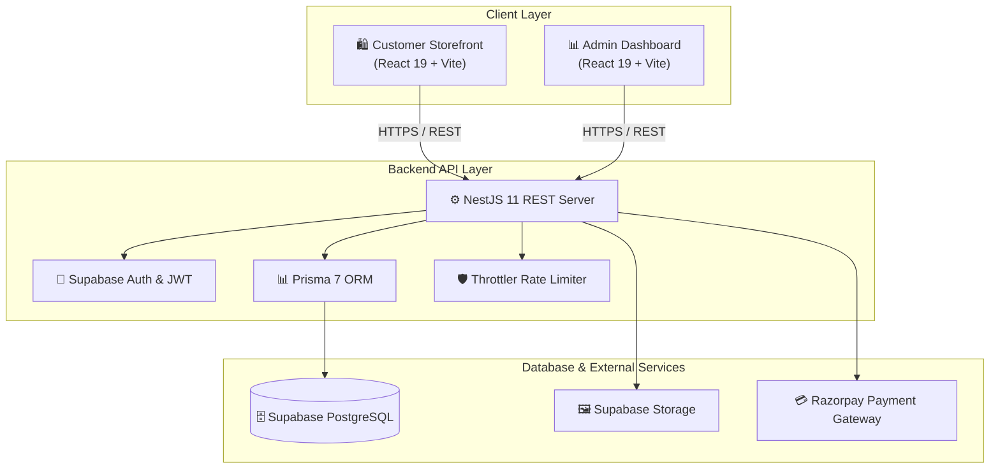

<div align="center">
  

  <br />

  <h1>🔥 FAN CLUB</h1>

  <p align="center">
    <strong>The Next-Generation Full-Stack E-Commerce & Loyalty Ecosystem</strong>
  </p>

  <p align="center">
    A high-performance, enterprise-grade e-commerce storefront and admin management platform.<br />
    Engineered with <strong>React 19</strong>, <strong>NestJS 11</strong>, <strong>TypeScript 5</strong>, <strong>Prisma 7</strong>, and <strong>Supabase</strong>.
  </p>

  <p align="center">
    <a href="#-customer-storefront-frontend"><strong>Explore Storefront »</strong></a> &nbsp;•&nbsp;
    <a href="#-admin-dashboard-admin"><strong>Admin Panel »</strong></a> &nbsp;•&nbsp;
    <a href="#-backend-api-backend"><strong>API Reference »</strong></a> &nbsp;•&nbsp;
    <a href="#-architecture"><strong>Architecture »</strong></a>
  </p>

  <br />

  <p align="center">
    
    
    
    
    
    
    
  </p>

  <p align="center">
    
    
    
  </p>
</div>

---

## ⚡ Executive Summary

**FAN Club** is a premium, full-stack e-commerce solution designed for modern digital storefronts. Built with a decoupled monorepo architecture, it combines a ultra-fast customer-facing React storefront, an intuitive administrative control panel, and a resilient, rate-limited NestJS REST backend connected to Supabase PostgreSQL via Prisma ORM.

### 🌟 Key Platform Highlights
- 🛍️ **Gamified Loyalty Club:** Interactive stamp card rewards system with instant tier claims & coupon unlocks.
- ⚡ **Lightning Fast UI:** React 19 + Vite 8 setup delivering instant HMR, code splitting, and optimized asset delivery.
- 🔒 **Enterprise-Grade Security:** Throttled endpoints, JWT authentication, helmet headers, and bcrypt credential hashing.
- 💳 **Integrated Payments:** End-to-end Razorpay checkout with webhook verification and payment tracking.
- 📊 **Real-Time Analytics:** Operational dashboard with live metrics, order volume tracking, and revenue insight.

---

## 🏗️ Architecture

The repository is structured as a clean monorepo separating concerns across user roles:



### 📁 Directory Layout

```text
FANCLUB/
├── 🛍️ frontend/         # Customer Storefront (React 19, Tailwind/CSS, Framer Motion)
├── 📊 admin/            # Admin Panel (React 19, Vite, Analytics Dashboard)
├── ⚙️ backend/          # REST API (NestJS 11, Prisma 7, Supabase Services)
├── 📦 docker-compose.yml# Container orchestration
└── 🚀 render.yaml       # Infrastructure deployment config
```

---

## ✨ Features Deep-Dive

### 🛍️ Customer Storefront (`/frontend`)
> Built for conversion, accessibility, and high visual appeal.

* **Dynamic Hero & Showcase:** Video/image hero carousel with dynamic branding animations.
* **Smart Catalog & Search:** Real-time search indexing, category tags, and responsive product filtering.
* **Loyalty Stamp System:** Interactive visual stamps tracking purchases with rewards claim triggers.
* **Frictionless Shopping:** Side drawer cart, instant guest cart merging, and wishlist management.
* **Secure Checkout:** Direct integration with Razorpay payment processing and real-time order tracking.

### 📊 Admin Dashboard (`/admin`)
> Total command over product catalog, inventory, and order fulfillment.

* **KPI & Revenue Overview:** Real-time analytics charts and sales performance summaries.
* **Product Catalog Management:** Full CRUD with drag-and-drop Supabase image uploads and stock controls.
* **Order Processing & Audit:** Filterable order stream, status workflow triggers, and customer CRM tools.
* **Promotions & Coupons:** Custom coupon generator with usage caps and discount management.

### ⚙️ Backend REST Server (`/backend`)
> Resilient, modular backend architecture built with NestJS.

* **Security Hardening:** `@nestjs/throttler` anti-abuse protection, Cors origin policies, and Helmet headers.
* **Data Persistence:** Prisma 7 client with PostgreSQL migration workflows.
* **File Management:** Direct integration with Supabase Storage buckets for product media.
* **Interactive API Documentation:** Auto-generated Swagger interface at `/api`.

---

## 💻 Tech Stack Overview

| Domain | Technology | Details |
|:---|:---|:---|
| **Frontend Framework** | **React 19** | Modern UI rendering with React Router DOM v7 |
| **Admin Framework** | **React 19** | Responsive administrative interface |
| **Backend Core** | **NestJS 11** | Scalable, modular TypeScript REST API |
| **Database & ORM** | **PostgreSQL + Prisma 7** | Hosted on Supabase with type-safe schema mapping |
| **Authentication** | **Supabase Auth / JWT** | Secure token handling, bcrypt hashing & session management |
| **Payments** | **Razorpay API** | Webhook verification, payment status lifecycle |
| **Styling & Motion** | **Framer Motion & CSS** | Micro-interactions, smooth page transitions |
| **Build Engine** | **Vite 8** | High-speed bundling & HMR |
| **Hosting & Infra** | **Vercel & Render / Cloud Run** | Continuous deployment pipelines |

---

## 🛠️ Getting Started

Follow these steps to launch the entire project environment locally.

### Prerequisites
* **Node.js** v18.0.0 or higher
* **npm** v9.0.0 or higher
* A **Supabase** Project (PostgreSQL database + Storage bucket)
* A **Razorpay** Account (for test payments)

---

### 1️⃣ Clone Repository
```bash
git clone https://github.com/maniprasad76/FANCLUB.git
cd FANCLUB
```

---

### 2️⃣ Backend Configuration & Launch

<details>
<summary><b>Click to expand Backend setup instructions</b></summary>

```bash
cd backend
npm install
```

Create a `.env` file in `backend/`:
```env
PORT=3001
DATABASE_URL="postgresql://<user>:<password>@<host>:5432/<dbname>"
DIRECT_URL="postgresql://<user>:<password>@<host>:5432/<dbname>"
SUPABASE_URL="https://<your-supabase-id>.supabase.co"
SUPABASE_KEY="<your-supabase-anon-key>"
RAZORPAY_KEY_ID="<your-razorpay-key-id>"
RAZORPAY_KEY_SECRET="<your-razorpay-key-secret>"
FRONTEND_URL="http://localhost:5173"
ADMIN_URL="http://localhost:5174"
```

Run migrations and start server:
```bash
npx prisma migrate deploy
npm run dev
```

> 🌐 **Server API:** `http://localhost:3001`  
> 📑 **Swagger API Docs:** `http://localhost:3001/api`

</details>

---

### 3️⃣ Frontend Storefront Launch

<details>
<summary><b>Click to expand Storefront setup instructions</b></summary>

```bash
cd frontend
npm install
```

Create `.env` in `frontend/`:
```env
VITE_API_URL="http://localhost:3001"
VITE_SUPABASE_URL="https://<your-supabase-id>.supabase.co"
VITE_SUPABASE_ANON_KEY="<your-supabase-anon-key>"
```

Start dev server:
```bash
npm run dev
```

> 🛍️ **Storefront UI:** `http://localhost:5173`

</details>

---

### 4️⃣ Admin Dashboard Launch

<details>
<summary><b>Click to expand Admin Dashboard setup instructions</b></summary>

```bash
cd admin
npm install
```

Create `.env` in `admin/`:
```env
VITE_API_URL="http://localhost:3001"
VITE_SUPABASE_URL="https://<your-supabase-id>.supabase.co"
VITE_SUPABASE_ANON_KEY="<your-supabase-anon-key>"
```

Start dev server:
```bash
npm run dev
```

> 📊 **Admin Dashboard:** `http://localhost:5174`

</details>

---

## 📡 REST API Reference

The backend provides structured REST endpoints. Explore the interactive documentation via Swagger at `/api`.

| Method | Endpoint | Description | Auth Required |
|:---:|:---|:---|:---:|
| `POST` | `/auth/signup` | Register new customer account | No |
| `POST` | `/auth/signin` | Customer / Admin login | No |
| `GET` | `/products` | Fetch product catalog with filtering & search | No |
| `GET` | `/products/:id` | Fetch product detail | No |
| `GET` | `/cart` | Retrieve shopping cart items | Yes |
| `POST` | `/cart` | Add / Update cart items | Yes |
| `POST` | `/payments/create-order` | Initialize Razorpay order token | Yes |
| `POST` | `/payments/verify` | Verify Razorpay payment signature | Yes |
| `GET` | `/loyalty/stamps` | Fetch user loyalty stamp progress | Yes |
| `GET` | `/dashboard/stats` | Retrieve admin dashboard analytics | Admin |

---

## ☁️ Deployment Guide

| Service | Recommended Host | Setup Notes |
|:---|:---|:---|
| **Storefront (`/frontend`)** | **Vercel** | Connect repo root, select root directory `frontend`, set `VITE_API_URL`. |
| **Admin Panel (`/admin`)** | **Vercel** | Select root directory `admin`, set `VITE_API_URL`. |
| **REST API (`/backend`)** | **Render / Cloud Run** | Run `npm run build` and `npx prisma migrate deploy` in build command. |

---

## 🤝 Contributing

Contributions make the open-source community an incredible place to learn, inspire, and create.

1. Fork the Repository
2. Create your Feature Branch (`git checkout -b feature/CoolFeature`)
3. Commit your changes (`git commit -m 'feat: add CoolFeature'`)
4. Push to your branch (`git push origin feature/CoolFeature`)
5. Open a Pull Request

---

## 🛡️ License

Distributed under the MIT License. See `LICENSE` for more information.

---

<div align="center">
  <p>Crafted with ❤️ for the <strong>FAN Club Community</strong></p>
  
</div>

